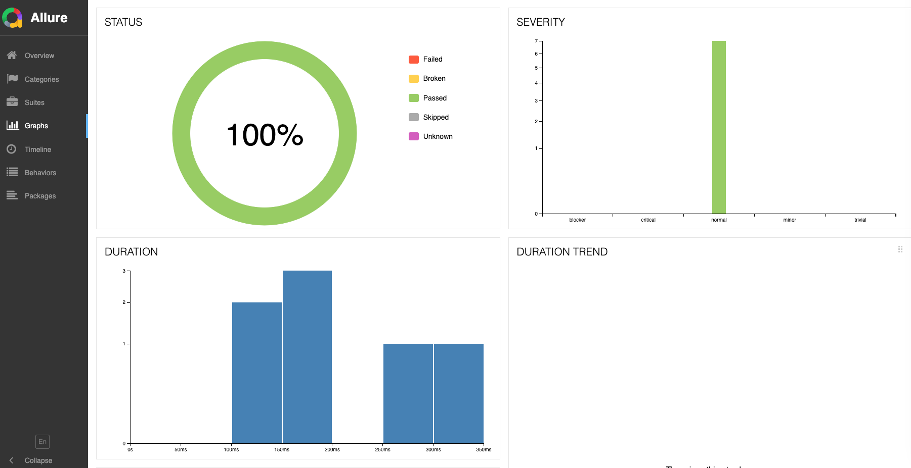

<div align="center">
<h1> API Automation project 🤖 </h1>

API Automation project on Bank of Canada valet api using Playwright tool.

</div>


## 📦 Installation
- Project requires NodeJs and npm installed as pre-requisite.

 To install and run this project, follow these steps:
```bash
git clone <repo_path>
npm install
```

## 🎮 Run
 To run the tests 
 ```
 npx playwright test
 ```
 which runs all tests and shows the results in console as:

 


  To generate the Allure report and open it locally on browser as html:
  ```
  npx allure generate allure-results --clean
  npx allure open allure-report
  ```

  which open the html report in browser as :

  

  In this report, different features can be accessed in left panel for suites detailed view:

  


  graphs view of executed tests

  


  ## 🚦 Observations
  - API doesn't run for USD to AUD conversion inputs. Even though these are valid inputs but the valet API throws 404 error. Like this few more conversions fail
  (Have also covered in the testcase)

  - Have used mainly the `/observations` series endpoint from the API schema for the framework and initial analysis purpose.

  - Also covered mutliple series names scenario in testcases since it's supported by this  modular framework.

  - this valet api has only `get` requests api in the documentation. Other `post, put, delete` can also be leveraged with this framework.

  - Also added one of other api usage as well in one of the tests.


  ## 📝 Notes
  - If we want to give more time and all mentioned api's in valet documentation can be added this framework for full tets coverage.
  
  - More extensive positive and negative cases can be added if time allows.
  Example, for reponses the description, labels, series names .. fields can be vaidated as well.

  - github actions (CI/CD) integrations can be surely added to the code which can run in our target project's every pull request. 

  - More advanced helper or common functions can be developed to handle the complex scenarios.


  ## 📢 Acknowledgments
  Referred Bank of Canada valet API and its related docs.
  [https://www.bankofcanada.ca/valet/docs]
