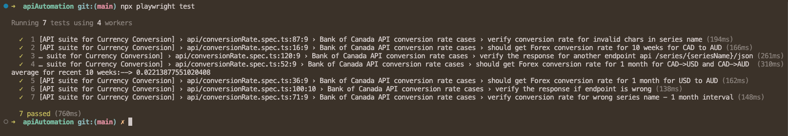
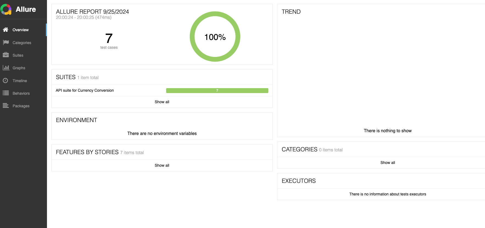
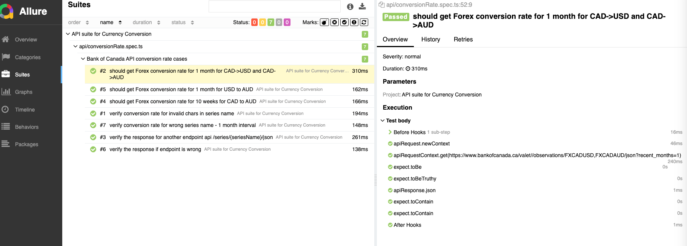

<div align="center">
<h1> ⚙️ API Automation project 🤖 </h1>

API Automation project on Bank of Canada valet api using Playwright tool

</div>


## 📦 Installation
- Project requires NodeJs and npm installed as pre-requisite.

 To install and run this project, follow these steps:
```bash
git clone <repo_path>
npm install
```

## 🎮 Run
 To run the tests 
 ```
 npx playwright test
 ```
 which runs all tests and shows the results in console as:
 


  To generate the Allure report and open it locally on browser as html:
  ```
  npx allure generate allure-results --clean
  npx allure open allure-report
  ```

  which open the html report in browser as :

  

  In this report, different features can be accessed in left panel for suites detailed view:
  

